# <p align="center">ReliaChat AI Innovations App (Source-Code)</p>
> [!IMPORTANT]
> This project is under the GNU AFFERO GENERAL PUBLIC LICENSE v3

<br><br>
> [!IMPORTANT]
>[Github Project](https://github.com/LTS-VVE/ReliaChat)<br>
>[Gitlab Project](https://gitlab.com/LTS-VVE/ReliaChat)
## ``` Version 1.3.2-BETA ```

[Android Build](https://github.com/LTS-VVE/ReliaChat/releases/tag/Android)<br>
[iOS Build (Comming soon)](https://github.com/LTS-VVE/ReliaChat/builds/iOS)
> [!NOTE]
> That, you can build it for iOS in your own machine, however you cannot install a pre-compiled IPA for iOS, therefore if no recources are avaible to you, we recommend you use cloud VPS(es) or wait for the build.

> [!IMPORTANT]
> Please make sure you report issues that occurr within the app, this could help us move forward with the project.

> [!TIP]
> Please make sure you are within the EU to install (sideload) apps on iOS.
<br><br>
# <p align="center">What about ReliaChat?</p>
<br>
<br>
<br>
<p align="center">
  
  
  
</p>
<br>
<br>
<p align="center">ReliaChat is an open-source app, made for a high school project, build using the Flet Flutter Python  Framework to connect locally on a set port on your device via requests and the Termux/iSH (For android and iOS repectively.) app.
It has a modern UI, Easy to use frontend, and easy command pasting for non-advanced users, while maintaining massive language support, easy of use, and being privacy respecting.</p><br><br>

> [!WARNING]
> We recommned you follow the [commands](https://github.com/LTS-VVE) to install ollama on your mobile device (Android/iOS) platforms in order to chat with the desired or preset AI model.

> [!NOTE]
> The UI has been costumized to feel modern and easy to use, however this is the very first
> version, and some UI featured may not work as expected.
## How the app behaives when ran:
> [!NOTE]
> UI On Sidebar


<br>
> [!IMPORTANT]
> UI, MAY NOT WORK AS EXPECTED. IT IS EXPERIMENTAL.

> [!NOTE]
> Greeting based on system time.


> [!NOTE]
> Erase all chats function (`Erasing All Chat History`), and the Settings tab.


## How the App Works

```mermaid
%%{init: {
  'theme': 'dark',
  'themeVariables': {
    'fontFamily': 'arial',
    'fontSize': '16px',
    'lineColor': '#808080',
    'primaryColor': '#1f2937',
    'primaryTextColor': '#ffffff',
    'primaryBorderColor': '#404040',
    'secondaryColor': '#2d3748',
    'tertiaryColor': '#374151'
  }
}}%%

graph TD
    %% Define main components
    subgraph Termux[Termux Environment]
        direction TB
        TermuxNode[("Termux<br/>Mobile Linux Environment")]
        style TermuxNode fill:#1f2937,stroke:#404040
    end

    subgraph Client[Client Layer]
        direction TB
        FrontendNode["Frontend<br/>(Flet App)<br/>Python UI Framework"]
        style FrontendNode fill:#2d3748,stroke:#404040
    end

    subgraph Server[Server Layer]
        direction TB
        BackendNode["Backend Server<br/>(Flask)<br/>Port: 8000"]
        style BackendNode fill:#374151,stroke:#404040
    end

    subgraph AI[AI Service]
        direction TB
        OllamaNode["Ollama Server<br/>Local LLM Service<br/>Port: 11434"]
        style OllamaNode fill:#1f2937,stroke:#404040
    end

    %% Define relationships with detailed labels
    FrontendNode -->|"1. HTTP Requests<br/>REST API Calls"| BackendNode
    BackendNode -->|"2. LLM Queries"| OllamaNode
    OllamaNode -->|"3. AI Responses"| BackendNode
    BackendNode -->|"4. JSON Response"| FrontendNode
    
    %% Hosting relationships
    TermuxNode -.->|"Hosts & Manages"| BackendNode
    TermuxNode -.->|"Hosts & Manages"| OllamaNode

    %% Styling
    classDef default fill:#2d3748,stroke:#404040,color:#fff
    classDef container fill:#1f2937,stroke:#404040,color:#fff
    
    %% Apply container styling to subgraphs
    class Termux,Client,Server,AI container
```

We use the Requests via urllib since, building the app for iOS and Android with the `Requests` module fails.
```python
import urllib.request
```
In contrast with defining to get the ollama (`def get_ollama_response`) response:
```python
def get_ollama_response(message, ip, port, temperature, custom_endpoint):
    url = f"http://{ip}:{port}{custom_endpoint}"
    headers = {
        "Content-Type": "application/json",
    }
    data = {
        "prompt": message,
        "temperature": temperature
    }
    
    try:
        data_bytes = json.dumps(data).encode('utf-8')
        req = urllib.request.Request(
            url,
            data=data_bytes,
            headers=headers,
            method='POST'
        )
        
        response_data = ""
        with urllib.request.urlopen(req) as response:
            for line in response:
                line = line.decode('utf-8')
                if line.startswith("data:"):
                    response_part = json.loads(line[5:])['response']
                    response_data = response_part  # Update the response_data to the latest part
                    print(response_part)  # Print each part of the response for debugging
        return response_data
    except Exception as e:
        return f"Failed to connect to server at {url}. Please check the IP and Port. Error: {str(e)}"
```
In the code above the ip, port and endpoint are taken from `settings.json` to connect to the desired open IP Adress and Port, with the desried endpoint.
<br>The function to save the ollama response via a confirmation dialog:
```python
def save_settings_action(e):
            save_settings(ip_field.value, port_field.value, username_field.value, "light" if theme_toggle.value else "dark", float(temperature_input.value), custom_endpoint_field.value)
            dlg.open = False
            page.update()
```
If the dialog is open (`dlg.open = False`), then the dialog will not be shown, if value is set to `True`, it will show the settings there for showing the endpoint, port, and ip on the frontend.
When the settings are saved it will grab them and place them in the `{port/custom_endpoint/ip}`. This will make a connection to the backend server (`Flask Py Server`) to route the ip to the default set `IP`, `PORT` and `ENDPOINT`.<br>
In the backend, we will route the Ollama server (`ollama serve &`), to the custom endpoint.
```python
@app.route('/api/v1/query', methods=['POST'])
def query_model():
    data = request.get_json()
    prompt = data.get("prompt", "")
```
After the process is completed, we will gain 2 streaming responses (repeated) from the Flask server, therefore the code was modified to remove doubled streaming responses.
> [!NOTE]
> Make sure to view your custom code carefully as the function could break easily, removing the casting response from the server.

<br>As for language support you simply go to the `translations.py` file, and translate the functions to your preferred langauge.<br>
Example:
```python
"en": {
        "settings": "Settings",
        "help": "Help",
        "privacy_policy": "Privacy Policy",
        "about": "About",
        "terms_of_use": "Terms of Use",
        "erase_all_chats": "Erase All Chats",
    },
```
In the code, simply replace the "en" with your preferred language and provide translations inside the parantheses after the colon's `:`. (ex. `"settings" : "Einstellungen"`). And change the parantheses of `"en"` to any language (ex. `"de"`)
<br><br>
> [!NOTE]
> Other Featured like a time based greeting, animatined typewritter and blinking cursor are implemented, along with a copy button, chat history and transparent blurry chat bubbles. (Basic app amenities.)
## Supported Languages
> [!NOTE]
> More languages will be added soon. (Any language can be added manually by editing the code, however on the main repo, the following are supported by default).<br><br>

> [!NOTE]
> NOTE, THAT THESE ARE APP LANGAUGES, AND NOT AI LANGUAGES. CHOOSE YOUR AI MODEL, IF YOU WANT MULTI-LANGUAL SUPPORT FOR THE RESPONSES, PLEASE USE A MULTI-LANGUAL MODEL.
<div align="center">

| <p align="center">Language          | <p align="center">Flag       |
|-------------------|------------|
| <p align="center">English           | <p align="center">🇺🇸</p>        |
| <p align="center">Albanian          | <p align="center">🇦🇱        |
| <p align="center">German            | <p align="center">🇩🇪        |
| <p align="center">Danish            | <p align="center">🇩🇰        |
| <p align="center">Hungarian         | <p align="center">🇭🇺        |
| <p align="center">Irish             | <p align="center">🇮🇪        |
| <p align="center">Italian           | <p align="center">🇮🇹        |
| <p align="center">Norwegian         | <p align="center">🇳🇴        |
| <p align="center">Ukrainian         | <p align="center">🇺🇦        |
| <p align="center">Romanian          | <p align="center">🇷🇴        |
| <p align="center">Russian           | <p align="center">🇷🇺        |
| <p align="center">Spanish           | <p align="center">🇪🇸        |
| <p align="center">French            | <p align="center">🇫🇷        |
| <p align="center">Swedish           | <p align="center">🇸🇪        |
| <p align="center">Simplified Chinese| <p align="center">🇨🇳        |
| <p align="center">Cantonese (Traditional Chinese) | <p align="center">🇭🇰 |
| <p align="center">Japanese          | <p align="center">🇯🇵        |
| <p align="center">Korean            | <p align="center">🇰🇷        |
| <p align="center">Hindi             | <p align="center">🇮🇳        |
| <p align="center">Tamil             | <p align="center">🇱🇰        |
| <p align="center">Hebrew            | <p align="center">🇮🇱        |
| <p align="center">Arabic            | <p align="center">🇦🇪        |
| <p align="center">Amharic           | <p align="center">🇪🇹        |
| <p align="center">Swahili           | <p align="center">🇹🇿        |
| <p align="center">Persian (Farsi)   | <p align="center">🇮🇷        |
| <p align="center">Nepali            | <p align="center">🇳🇵        |
| <p align="center">Filipino          | <p align="center">🇵🇭        |
| <p align="center">Bulgarian         | <p align="center">🇧🇬        |
| <p align="center">Thai              | <p align="center">🇹🇭        |
| <p align="center">Portuguese        | <p align="center">🇵🇹        |
| <p align="center">Portuguese (Brazil) | <p align="center">🇧🇷      |
| <p align="center">Indonesian        | <p align="center">🇮🇩        |
| <p align="center">Greek             | <p align="center">🇬🇷        |
| <p align="center">Croatian          | <p align="center">🇭🇷        |
| <p align="center">Serbian           | <p align="center">🇷🇸        |
| <p align="center">Finnish           | <p align="center">🇫🇮        |
| <p align="center">Macedonian        | <p align="center">🇲🇰        |
| <p align="center">Polish            | <p align="center">🇵🇱        |
| <p align="center">Turkish           | <p align="center">🇹🇷        |
| <p align="center">Georgian          | <p align="center">🇬🇪        |
| <p align="center">Kazakh            | <p align="center">🇰🇿        |
| <p align="center">Malay             | <p align="center">🇲🇾        |
| <p align="center">Vietnamese        | <p align="center">🇻🇳        |
| <p align="center">Czech             | <p align="center">🇨🇿        |
| <p align="center">Latin             | <p align="center">🇺🇳        |

</div>
