> [!NOTE]
> We have fixed the backend issue, and you can now officially chat with an LLM of your choice, at any time. (As long as the model is installed).<br><br>

> [!NOTE]
> The new build for v.1.3.5 has fixed color issues that are not supported in flet `0.26.0`.<br>
# <p align="center">ReliaChat AI Innovations App (Source-Code)</p>
> [!IMPORTANT]
> This project is under the GNU AFFERO GENERAL PUBLIC LICENSE v3.<br>

> [!IMPORTANT]
> Please report issues on the github/gitlab issues tab or directly email us at: reliachat@proton.me.
<br>

> [!IMPORTANT]
>[Github Project](https://github.com/LTS-VVE/ReliaChat)<br>
>[Gitlab Project](https://gitlab.com/LTS-VVE/ReliaChat)
## ``` Version 1.3.4-BETA ```.
> [!NOTE]
> NEW RELEASE ``` V 1.3.4-BETA ```.

> [!TIP]
> What's in the new release?
> <br>1. **Word filtering has been improved. Words that include profanity, discrimination and illegal behaviors has been improved.**
> <br><br>2. **UI Changes. (Chatbubble changes, filter chatbubble, performance updates, user chatbubble changes, padding.)**
> <br><br>3. **Description update.**

> [!IMPORTANT]
> We will add filtering for AI in the future releases.

> [!CAUTION]
> ReliaChat AI Innovations, IS NOT RESPONSIBLE FOR ANY ACTIONS YOU MAKE USING THE AI APP. THE APP IS BUILD AS FRONT-END, AND HAS RESPONSIBILITY TO SEND REQUESTS LOCALLY ON ALREADY TRAINED MODELS (Such as [Ollama Models](https://ollama.com/models), [Hugging Face](https://huggingface.co/models) or external sources for customizability).<br> THESE MODELS ARE PRE-TRAINED BY OPEN-SOURCE COMMUNITIES. PLEASE BE SURE TO USE THE SOFTWARE PROVIDED BY ReliaChat AI Innovations, ETHICALLY.

> [!NOTE]
> This filtering feature can be turned off via the setting menu. <br><br>

> [!NOTE]
> That, you can build it for iOS in your own machine, however you cannot install a pre-compiled IPA for iOS, therefore if no recources are avaible to you, we recommend you use cloud VPS(es) or wait for the official build for iOS devices.

> [!IMPORTANT]
> Please make sure you report issues that occurr in the app via github, gitlab or via our email at reliachat@proton.me. This will help us move forward with the project.

> [!TIP]
> Please make sure you are within the EU to install (sideload) apps on iOS.
<br><br>

# Builds
[Android Build](https://github.com/LTS-VVE/ReliaChat/releases/tag/V-1.3.3_PRE-RELEASE_ANDROID)<br>
[iOS Build (Comming soon)](https://github.com/LTS-VVE/ReliaChat)<br><br>
> [!NOTE]
> Please remember that the iOS build is likely to come out on the first stable release.
<br><br>
# <p align="center">What about ReliaChat?</p>
<br>
<br>
<br>
<p align="center">
  
  
  
</p>
<br>
<br>
<p align="center">ReliaChat is an open-source app, made for a high school project, build using the Flet Flutter Python  Framework to connect locally on a set port on your device via requests and the Termux/iSH (For android and iOS repectively.) app.
It has a modern UI, Easy to use frontend, and easy command pasting for non-advanced users, while maintaining massive language support, easy of use, and being privacy respecting.</p><br><br>

> [!WARNING]
> We recommned you follow the [commands](https://github.com/LTS-VVE/ReliaChat/blob/main/commands.txt) to install ollama on your mobile device (Android/iOS) platforms in order to chat with the desired or preset AI model.

> [!TIP]
> Commands to install it for android:

```
pkg update -y && pkg upgrade -y
pkg install -y python curl wget openssh git golang cmake clang
python -m ensurepip --upgrade
pip install flask requests
git clone https://github.com/ollama/ollama.git
cd ollama
go generate ./...
go build .
./ollama pull gemma:2b
wget https://raw.githubusercontent.com/LTS-VVE/ReliaChat/main/backend/backend_server_for_mobile.py
echo -e "\033[32m⠀⠀⠀⠀⠀⠀⠀⠀⠀⠀⠀⢀⣤⣤⡀⠀⠀⠀⠀⠀⠀⠀⠀⠀⠀⠀
⠀⠀⠀⠀⠀⠀⣰⣶⣦⣤⣤⣾⣿⣿⣿⣤⣤⣴⣶⣦⠀⠀⠀⠀⠀⠀
⠀⠀⠀⠀⠀⢀⣿⣿⣿⣿⣿⣿⣿⣿⣿⣿⣿⣿⣿⣿⡀⠀⠀⠀⠀⠀
⠀⠀⣴⣾⣿⣿⣿⣿⣿⣿⣿⣿⣿⣿⣿⣿⣿⣿⣿⣿⣿⣿⣷⣦⠀⠀
⠀⠀⠸⣿⣿⣿⣿⣿⣿⣿⣿⣿⣿⣿⣿⣿⡿⠻⣿⣿⣿⣿⣿⡏⠀⠀
⠀⢀⣴⣿⣿⣿⣿⣿⣿⣿⣿⣿⣿⣿⡿⠋⠀⢀⣼⣿⣿⣿⣿⣦⡀⠀
⠰⣿⣿⣿⣿⣿⣿⣿⡿⠋⠻⣿⠟⠃⠀⢀⣴⣿⣿⣿⣿⣿⣿⣿⣿⠆
⠀⠈⠻⣿⣿⣿⣿⣿⣷⣄⠀⠀⠀⢀⣴⣿⣿⣿⣿⣿⣿⣿⣿⠟⠁⠀
⠀⠀⣰⣿⣿⣿⣿⣿⣿⣿⣷⣤⣴⣿⣿⣿⣿⣿⣿⣿⣿⣿⣿⣆⠀⠀
⠀⠀⠻⠿⣿⣿⣿⣿⣿⣿⣿⣿⣿⣿⣿⣿⣿⣿⣿⣿⣿⣿⠿⠟⠀⠀
⠀⠀⠀⠀⠀⠈⣿⣿⣿⣿⣿⣿⣿⣿⣿⣿⣿⣿⣿⣿⠁⠀⠀⠀⠀⠀
⠀⠀⠀⠀⠀⠀⠹⠿⠿⠛⠛⢿⣿⣿⣿⠛⠛⠻⠿⠏⠀⠀⠀⠀⠀⠀
⠀⠀⠀⠀⠀⠀⠀⠀⠀⠀⠀⠀⠙⠙⠁⠀⠀⠀⠀⠀⠀⠀⠀⠀⠀⠀ \033[0m"
echo -e "\033[32mInstallation and setup complete. Ollama and ReliaChat backend are ready to launch. Launching Server... Thank you for using ReliaChat! When attempting to relaunch the api server simply run python3 ~/ollama/backend_server_for_mobile.py or by going into the directory and running python3 backend_server_for_mobile.py. \033[0m"
./ollama serve &
python3 backend_server_for_mobile.py
```

> [!NOTE]
> The UI has been costumized to feel modern and easy to use, however this is the very first
> version, and some UI featured may not work as expected.
## How the app behaives when ran:
> [!NOTE]
> UI On Sidebar.


<br>
> [!IMPORTANT]
> UI, may not work well, as it is in early development. Please report you're issues in the github/gitlab issues section or send us an email on reliachat@proton.me.

> [!NOTE]
> We are currently aware of the stack bug on mobile when tried to change the settings (such as not formated text entery container boxes).<br> We will fix this in the future release. 

> [!NOTE]
> Greeting based on system time.


> [!NOTE]
> Erase all chats function (`Erasing All Chat History`), and the Settings tab.


> [!NOTE]
> How the AI responds visually.

<br>
> [!NOTE]
> How the AI responds visually, when prompted a filtered/censored word or a string of characters containg the phrases.

<br>
## How the App Works
### New filtering System:

> [!WARNING]
> The code below is a demonstration of how it works, the word list is located on the frontend folder of this github repo.

```python
# This script defines a function called `strict_content` which is used for content moderation.
# The function checks if any blocked words are present in the given content and returns True if any are found.
# This is useful for filtering out inappropriate or harmful content in user-generated inputs. ReliaChat AI Innovations, IS NOT RESPONSIBLE FOR ANY WARRNTY
# OR MISUSE ON THE SOFTWARE. THE SOFTWARE IS PROVIDED AS IS. FOR MORE INFO GO TO: https://github.com/LTS-VVE/ReliaChat/blob/main/LICENSE, TO VIEW THE LICENSE.

def strict_content(content):
    # Blocked Words.
    # NOTE THAT THIS SECTION OR FILE OF CODE IS SIMPLY FOR MODERATION, AND ReliaChat AI Innovations IS NOT PROMOTING, ADVERTISING, OR HAVING RELIABILITY
    # FOR ANY OF THE WORDS, PROVIDED FOR MODERATION.
    blocked_words = [
        "badword1", "badword2",
    ]
    
    # Currently there only is 2 langauges for profanity check. Please view our READ.ME on github or gitlab for more info.


    # Check if any blocked word is in the content
    for word in blocked_words:
        if word in content.lower():
            return True
    
    return False
```
In the list we can see an example that if the user inputs the word that is containted within the `strict_content` file in this case `bardword1`, `badword2`, the frontend will block all attemps being made to the ollama server for extra-protection. This is done that if the AI Model is expiriencing inaccurate, morally wrong responses or hallucinations, the filter will act as a safe-guard to protect the user from unethical use of AI. This feature can be toggled off, however it is recommended to be kept on, as AI LLM's that are small like `gemma:2b`, or others, do not have enough tokens to enforce moderate responses. Therefore we imported a simple system so the user prompts are regulated to enforce safety.

> [!WARNING]
> Please note, that we are currently adding AI moderation to the filter as well, currently only user requests are filtered which could prove to be unethical, again ReliaChat AI Innovations is not responsible for any ACTION, taken on YOU'RE DEVICE. THE SOFTWARE IS PROVIDED AS IS, FOR MORE INFO GO TO [License](https://github.com/LTS-VVE/ReliaChat/blob/main/LICENSE).

```mermaid
%%{init: {
  'theme': 'dark',
  'themeVariables': {
    'fontFamily': 'arial',
    'fontSize': '16px',
    'lineColor': '#808080',
    'primaryColor': '#1f2937',
    'primaryTextColor': '#ffffff',
    'primaryBorderColor': '#404040',
    'secondaryColor': '#2d3748',
    'tertiaryColor': '#374151'
  }
}}%%
graph TD
    subgraph Termux["Termux/iSH Environment"]
        direction TB
        TermuxNode[("Mobile Linux/Unix Environment")]
        style TermuxNode fill:#1f2937,stroke:#404040
    end
    subgraph Client["Client Layer"]
        direction TB
        FrontendNode["Flet App<br/>Python UI Framework"]
        style FrontendNode fill:#2d3748,stroke:#404040
    end
    subgraph Moderation["Moderation Layer"]
        direction TB
        ModerationNode["Input Validation"]
        style ModerationNode fill:#1f2937,stroke:#404040
    end
    subgraph Server["Server Layer"]
        direction TB
        BackendNode["Flask Backend<br/>Port: 8000"]
        style BackendNode fill:#374151,stroke:#404040
    end
    subgraph AI["AI Service"]
        direction TB
        OllamaNode["Ollama LLM<br/>Port: 11434"]
        style OllamaNode fill:#1f2937,stroke:#404040
    end
    
    FrontendNode -->|"User Input"| Moderation
    Moderation -->|"Validated Input"| BackendNode
    BackendNode -->|"LLM Query"| OllamaNode
    OllamaNode -->|"AI Response"| BackendNode
    BackendNode -->|"JSON Result"| FrontendNode
    
    TermuxNode -.->|"Hosts"| BackendNode
    TermuxNode -.->|"Hosts"| OllamaNode
    
    classDef default fill:#2d3748,stroke:#404040,color:#fff
    classDef container fill:#1f2937,stroke:#404040,color:#fff
    
    class Termux,Client,Moderation,Server,AI container
```

## Diagram of how the app computes.<br>

<br><br>
## Ollama Server Requests<br>
We use the Requests via urllib since, building the app for iOS and Android with the `Requests` module fails.
```python
import urllib.request
```
In contrast with defining to get the ollama (`def get_ollama_response`) response:
```python
def get_ollama_response(message, ip, port, temperature, custom_endpoint):
    url = f"http://{ip}:{port}{custom_endpoint}"
    headers = {
        "Content-Type": "application/json",
    }
    data = {
        "prompt": message,
        "temperature": temperature
    }
    
    try:
        data_bytes = json.dumps(data).encode('utf-8')
        req = urllib.request.Request(
            url,
            data=data_bytes,
            headers=headers,
            method='POST'
        )
        
        response_data = ""
        with urllib.request.urlopen(req) as response:
            for line in response:
                line = line.decode('utf-8')
                if line.startswith("data:"):
                    response_part = json.loads(line[5:])['response']
                    response_data = response_part  # Update the response_data to the latest part
                    print(response_part)  # Print each part of the response for debugging
        return response_data
    except Exception as e:
        return f"Failed to connect to server at {url}. Please check the IP and Port. Error: {str(e)}"
```
In the code above the ip, port and endpoint are taken from `settings.json` to connect to the desired open IP Adress and Port, with the desried endpoint.
<br>The function to save the ollama response via a confirmation dialog:
```python
def save_settings_action(e):
            save_settings(ip_field.value, port_field.value, username_field.value, "light" if theme_toggle.value else "dark", float(temperature_input.value), custom_endpoint_field.value)
            dlg.open = False
            page.update()
```
If the dialog is open (`dlg.open = False`), then the dialog will not be shown, if value is set to `True`, it will show the settings there for showing the endpoint, port, and ip on the frontend.
When the settings are saved it will grab them and place them in the `{port/custom_endpoint/ip}`. This will make a connection to the backend server (`Flask Py Server`) to route the ip to the default set `IP`, `PORT` and `ENDPOINT`.<br><br>
## Backend.
In the backend, we will route the Ollama server (`ollama serve &`), to the custom endpoint.
```python
@app.route('/api/v1/query', methods=['POST'])
def query_model():
    data = request.get_json()
    prompt = data.get("prompt", "")
```
After the process is completed, we will gain 2 streaming responses (repeated) from the Flask server, therefore the code was modified to remove doubled streaming responses.
> [!NOTE]
> Make sure to view your custom code carefully as the function could break easily, removing the casting response from the server.

## Language Support Customization. (App layout).
<br>As for language support you simply go to the `translations.py` file, and translate the functions to your preferred langauge.<br>
Example:
```python
"en": {
        "settings": "Settings",
        "help": "Help",
        "privacy_policy": "Privacy Policy",
        "about": "About",
        "terms_of_use": "Terms of Use",
        "erase_all_chats": "Erase All Chats",
    },
```
In the code, simply replace the "en" with your preferred language and provide translations inside the parantheses after the colon's `:`. (ex. `"settings" : "Einstellungen"`). And change the parantheses of `"en"` to any language (ex. `"de"`)
<br><br>
> [!NOTE]
> Other Featured like a time based greeting, animatined typewritter and blinking cursor are implemented, along with a copy button, chat history and transparent blurry chat bubbles. (Basic app amenities.)
## Supported Languages.
> [!NOTE]
> More languages will be added soon. (Any language can be added manually by editing the code, however on the main repo, the following are supported by default).<br><br>

> [!NOTE]
> NOTE, THAT THESE ARE APP LANGAUGES, AND NOT AI LANGUAGES. CHOOSE YOUR AI MODEL, IF YOU WANT MULTI-LANGUAL SUPPORT FOR THE RESPONSES, PLEASE USE A MULTI-LANGUAL MODEL. `As mentioned earlier, moderation on applies
> for Albanian (Shqip), and English. Please add you're own moderation if wanted.`
<div align="center">

| <p align="center">Language          | <p align="center">Flag       |
|-------------------|------------|
| <p align="center">English           | <p align="center">🇺🇸</p>        |
| <p align="center">Albanian          | <p align="center">🇦🇱        |
| <p align="center">German            | <p align="center">🇩🇪        |
| <p align="center">Danish            | <p align="center">🇩🇰        |
| <p align="center">Hungarian         | <p align="center">🇭🇺        |
| <p align="center">Irish             | <p align="center">🇮🇪        |
| <p align="center">Italian           | <p align="center">🇮🇹        |
| <p align="center">Norwegian         | <p align="center">🇳🇴        |
| <p align="center">Ukrainian         | <p align="center">🇺🇦        |
| <p align="center">Romanian          | <p align="center">🇷🇴        |
| <p align="center">Russian           | <p align="center">🇷🇺        |
| <p align="center">Spanish           | <p align="center">🇪🇸        |
| <p align="center">French            | <p align="center">🇫🇷        |
| <p align="center">Swedish           | <p align="center">🇸🇪        |
| <p align="center">Simplified Chinese| <p align="center">🇨🇳        |
| <p align="center">Cantonese (Traditional Chinese) | <p align="center">🇭🇰 |
| <p align="center">Japanese          | <p align="center">🇯🇵        |
| <p align="center">Korean            | <p align="center">🇰🇷        |
| <p align="center">Hindi             | <p align="center">🇮🇳        |
| <p align="center">Tamil             | <p align="center">🇱🇰        |
| <p align="center">Hebrew            | <p align="center">🇮🇱        |
| <p align="center">Arabic            | <p align="center">🇦🇪        |
| <p align="center">Amharic           | <p align="center">🇪🇹        |
| <p align="center">Swahili           | <p align="center">🇹🇿        |
| <p align="center">Persian (Farsi)   | <p align="center">🇮🇷        |
| <p align="center">Nepali            | <p align="center">🇳🇵        |
| <p align="center">Filipino          | <p align="center">🇵🇭        |
| <p align="center">Bulgarian         | <p align="center">🇧🇬        |
| <p align="center">Thai              | <p align="center">🇹🇭        |
| <p align="center">Portuguese        | <p align="center">🇵🇹        |
| <p align="center">Portuguese (Brazil) | <p align="center">🇧🇷      |
| <p align="center">Indonesian        | <p align="center">🇮🇩        |
| <p align="center">Greek             | <p align="center">🇬🇷        |
| <p align="center">Croatian          | <p align="center">🇭🇷        |
| <p align="center">Serbian           | <p align="center">🇷🇸        |
| <p align="center">Finnish           | <p align="center">🇫🇮        |
| <p align="center">Macedonian        | <p align="center">🇲🇰        |
| <p align="center">Polish            | <p align="center">🇵🇱        |
| <p align="center">Turkish           | <p align="center">🇹🇷        |
| <p align="center">Georgian          | <p align="center">🇬🇪        |
| <p align="center">Kazakh            | <p align="center">🇰🇿        |
| <p align="center">Malay             | <p align="center">🇲🇾        |
| <p align="center">Vietnamese        | <p align="center">🇻🇳        |
| <p align="center">Czech             | <p align="center">🇨🇿        |
| <p align="center">Latin             | <p align="center">🇺🇳        |

</div>

> [!TIP]
> Hey! It looks like you actually read the documentation! We appriciate that!
